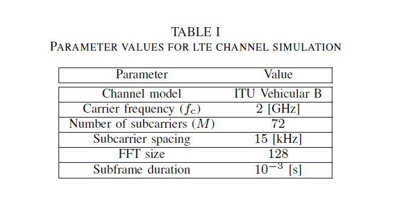
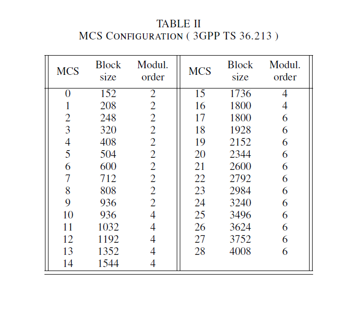

# Wireless link adaptation with outdated CSI -- a hybrid data-driven and model-based approach

## Introduction
This GitHub repository complements our paper [[1]](#ourpaper). In this repository, you can find the code to produce the plots in the paper. We address the issue of **link adaptation** in presence of outdated channel state information (CSI) at the base station (BS). 
There is a time delay between pilot transmission, CSI feedback reception at the base station, and eventual data transmission. During this time, called **feedback delay**, the wireless channel can vary substantially, nullifying the benefits of link adaptation, as the transmission parameters are matched to a channel that is no longer in effect at transmission time.

In order to compensate for this feedback delay, in our paper we present a **HYBRID** data-driven and model-based approach and an **END-TO-END (E2E)** machine learning approach. 
 - The hybrid approach is based on i) an FIR Wiener filter used to predict the instantaneous CSI from some past channel history available at the BS and ii) a neural network, whose input is the Wiener's prediction, used to select the optimal MCS for the data transmission. 
 - The E2E approach is based on a neural network which directly takes in input the channel history and selects the optimal MCS. 
 
We compare the hybrid approach and the E2E approach against each other and against a **delay-blind** approach which assumes that the outdated CSI at the BS is actually up-to-date. We use the delay-blind method as a baseline to show the degrading effects of outdated CSI on the system performance.

In this repository, the reader can investigate and explore the three link adaptation methods mentioned above, i.e., hybrid, E2E, and delay-blind, under two different experimental scenarios:

- *Scenario I* -- we assume that the **signal-to-noise ratio** of the channel and the **relative velocity** between the BS and the mobile user equipment **are known**
- *Scenario II* -- we assume that the **signal-to-noise ratio** of the channel and the **relative velocity** between the BS and the mobile user equipment **are not known**

The hybrid approach, the end-to-end appraoch and the delay-blind appraoch are applied to a simulated LTE link operating over an industry-standard radio channel model [[2]](#channel_model). We work with the complex-valued channel in the frequency domain, with 72 OFDM subcarriers. We represent the channel as a real-valued vector by stacking the real and the imaginary parts. 
We assume that the channel coefficients evolve as a Gaussian process and we assume they remain constant during each LTE subframe of 1 ms duration. Refer to the Table I for all the simulation parameters.

The base station can select 29 different MCSs, listed in the Table II:

For more details about the three approaches and the experimental scenarios, we encourage the reader to refer to our paper [[1]](#ourpaper).

## Computation Environment
In order to run the code in this repository in your own computation environment you need the following softwares:
* `Python 3` ( for reference we use Python 3.6.7 ), with the following packages:`numpy`, `matplotlib`,`scipy`,`time`,`ray`, `os`,`tabulate`,`keras`,`tensorflow`,`py-ittp`(install from https://github.com/vidits-kth/py-itpp).
* `Jupyter` ( for reference we use version 5.7.8 )

## Quick setup 

`chmod +x ./install_dependencies.sh`
`./install_dependencies.sh`

## Navigating through the repository
Here below, we list the files the reader can find in the repository.

* *radio_data/Generate_Data.ipynb* and *radio_data/Generate_Data_Distributed.ipynb*. In these notebooks, we report the code to generate the datasets used for training and testing the neural network models. In this repository the datasets used for training and testing are currently not available due to storage limitations, but they can be found at this link https://kth.box.com/s/tcd7y7rg3yau75kctw3regmyns8kfkr6 in the folder *Datasets*. The datasets contain channel realizations of a realistic LTE link operating over an industry-standard radio channel model. In *Generate_Data.ipynb* the code can be run on a single machine, but it is **computationally heavy**. In *Generate_Data_Distributed.ipynb* the same code is structured in order to be run on a cluster of machines. For this purpose, the package `ray` is used.

* *Channel_simulation_and_channel_prediction_with_FIR_Wiener_filter.ipynb*.
In this notebook we simulate a realistic LTE channel (in Part 1) and we perform channel prediction on the basis of the channel history, by applying Wiener filtering (in Part 2). The main aim is to let the reader familiarize with Wiener filter prediction applied to an LTE channel. The reader can explore the code, change various channel and filtering parameters, and see the effects on the prediction.

* *Plotting_the_results - Scenario_I (Scenario_II).ipynb*.
In this notebook, the reader can reproduce the plots of the paper, under Scenario I (Scenario II). This notebook assumes that there are trained neural network models to load and directly test. In this repository the trained models under Scenario I are available in the folder *Trained_models_ScenarioI*. The trained models under Scenario II are not available due to storage limitations, but they can be found at this link  https://kth.box.com/s/tcd7y7rg3yau75kctw3regmyns8kfkr6, under the folder Trained_models_ScenarioII. The test datasets can also be found at the same link, in the folder *Datasets*. By setting the variable 'load_from_memory = True', the plots of the paper can be displayed by loading the .npy variables contained in the folder Trained_models_ScenarioI_var(Trained_models_ScenarioII_var).

* *Delay_Blind_appraoch - Scenario_I (Scenario_II).ipynb*.
In this notebook, we report the code related to the delay-blind approach in our paper [[1]](#ourpaper), under Scenario I (Scenario II).

* *E2E_approach - Scenario_I (Scenario_II).ipynb*.
In this notebook, we report the code related to the E2E approach in our paper [[1]](#ourpaper), under Scenario I (Scenario II).

* *Hybrid_approach - Scenario_I (Scenario_II).ipynb*.
In this notebook, we report the code related to the hybrid approach in our paper [[1]](#ourpaper), under Scenario I (Scenario II).

* *Folders*:
  - Trained_models_ScenarioI: it contains the trained models under Scenario I
  - Trained_models_ScenarioI_var: it contains .npy variables that store the achieved spectral efficiencies under Scenario I and that can be used to generate the plots.
  - Traind_models_ScenarioII_var: tit contains .npy variables that store the achieved spectral efficiencies under Scenario II and that can be used to generate the plots.
  
Note: the datasets for training and testing the neural network models are available at: https://kth.box.com/s/tcd7y7rg3yau75kctw3regmyns8kfkr6 in the folder *Datasets*. The trained neural networks models are available at the same link, in the folder *Trained_models_ScenarioI* and *Trained_models_ScenarioII*. 

## References
 [1] "Wireless link adaptation - a hybrid data-driven and model-based approach", Lissy Pellaco, Vidit Saxena, Mats Bengtsson, Joakim Jaldén. Submitted to SPAWC 2020.

 [2] "ITU-R Recommendation M.1225", ITU Std., 1997.

